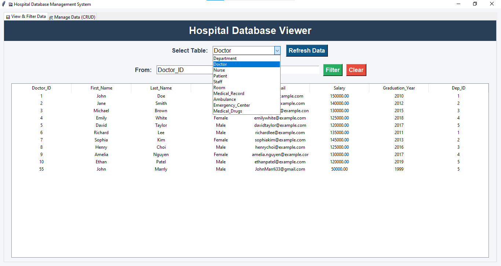

---

# 🏥 Hospital Database Project

This project presents the design and implementation of a **relational database** for a hospital management system. It covers **ERD design, table mapping, normalization (1NF → 3NF), SQL schema creation**, and **sample queries**. Additionally, a **Python GUI** is provided for easy data management and visualization.

---

## 📂 Project Structure

```
sql/
    HospitalDataBase.sql           → Database schema (tables, keys)
    HospitalDataBaseQueries.sql    → Sample SQL queries

docs/
    ERD.jpg                        → Entity Relationship Diagram
    Mapping.pdf                     → Entity-to-table mapping explanation
    Normalization.drawio.png        → Step-by-step normalization

GUI.ipynb                           → Python GUI implementation
Requirements.txt                    → Python dependencies
HospitalDataBase.db                  → Sample database (optional)
Demo/                                → Demo video
```

---

## ✨ Features

* View all hospital tables (Departments, Doctors, Nurses, Patients, Staff, Rooms, Medical Records, Ambulances, Emergency Centers, Medical Drugs).
* Filter records dynamically by column values.
* Add, Update, Delete records (**CRUD operations**).
* Refresh data dynamically from **SQL Server**.
* User-friendly GUI built with **Tkinter**.
* Integration with SQL Server backend.

---

## 📸 GUI Preview



---

## 📊 Entity Relationship Diagram


---
🎬 Demo Video

[Watch the demo](Demo/🏥%20Hospital%20Database%20Management%20System%20.mp4)

---
## 🧾 Documentation

* **Entity-to-Table Mapping:** `docs/Mapping.pdf`
* **Normalization Steps:** `docs/Normalization.drawio.png`

---

## ⚙️ How to Run

### Database Setup

1. Open `sql/HospitalDataBase.sql` in your SQL Server Management Studio (or other SQL client).
2. Execute the script to create the database schema.
3. Run `sql/HospitalDataBaseQueries.sql` to test sample queries.

### Python GUI

1. Install dependencies:

```bash
pip install -r Requirements.txt
```

2. Run the GUI:

```bash
python GUI.ipynb
```

> Make sure your SQL Server or local database is properly configured before running the GUI.

---
