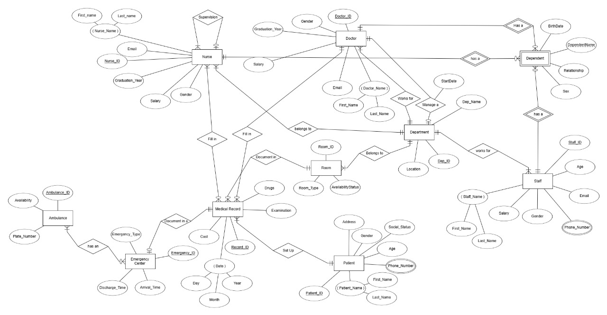

# 🏥 Hospital Database Project
<<<<<<< HEAD
This project presents the design and implementation of a relational database for a hospital management system. It covers ERD design, table mapping, normalization up to 3NF, SQL schema creation, and sample queries.
## 📁 Project Structure
 HospitalDataBase.sql → Database schema (tables, keys)
 HospitalDataBaseQueries.sql → Sample SQL queries
 ERD.png → Entity Relationship Diagram
 Mapping.pdf → Entity-to-table mapping explanation
 Normalization.pdf → Step-by-step normalization (1NF → 2NF → 3NF)
## 📸 Entity Relationship Diagram

=======

This project presents the design and implementation of a **relational database** for a hospital management system.  
It covers **ERD design, table mapping, normalization (1NF → 3NF), SQL schema creation, and sample queries**.

---

## 📂 Project Structure
- `sql/`
  - **HospitalDataBase.sql** → Database schema (tables, keys)
  - **HospitalDataBaseQueries.sql** → Sample SQL queries
- `docs/`
  - **ERD.jpg** → Entity Relationship Diagram
  - **Mapping.pdf** → Entity-to-table mapping explanation
  - **Normalization.drawio.png** → Step-by-step normalization

---

## 📊 Entity Relationship Diagram


---

## ⚙️ How to Run
1. Open `sql/HospitalDataBase.sql` in your SQL client (e.g., MySQL, PostgreSQL).
2. Execute the script to create the database schema.
3. Run `sql/HospitalDataBaseQueries.sql` to test the sample queries.

---

## 🧾 Documentation
- [Entity-to-Table Mapping](docs/Mapping.pdf)
- [Normalization Steps](docs/Normalization.drawio.png)

---

---

## 🖥️ GUI Preview


---

## ✨ Features
- View all hospital tables (Doctors, Patients, Rooms, Patients, etc.)
- Filter records by column values
- Add, Update, Delete records (CRUD operations)
- Refresh data dynamically from SQL Server
- User-friendly GUI built with Tkinter
- SQL Server backend integration

---

## ⚙️ How to Run (Database)
1. Open **`sql/HospitalDataBase.sql`** in your SQL Server Management Studio.
2. Execute the script to create the database schema.
3. Run **`sql/HospitalDataBaseQueries.sql`** to test the sample queries.

---

## ⚙️ How to Run (Python GUI)
1. Install dependencies:
   ```bash
   pip install -r requirements.txt


>>>>>>> f073983 (README.md)


